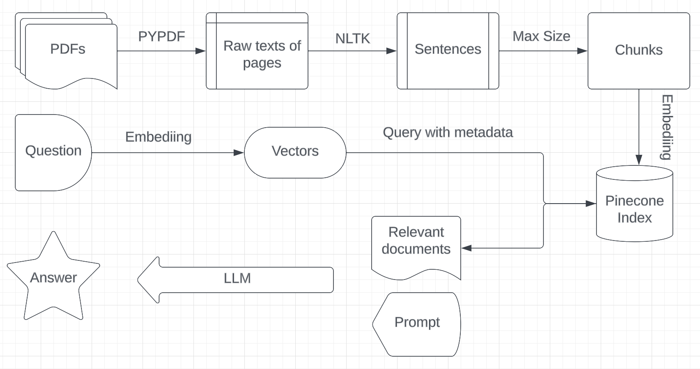

# Retrieve Augmented Generation
Retrieval Augmented Generation (RAG) systems that combine large language models with a private knowledge base. It generally consists of two stages: the indexing stage and the querying stage.



## Indexing stage

Convert PDF files into vectors and save the vectors and text in pinecone.

1. Use `PyPDF` to split pages and extract contents.
2. `NLTK` preprocess the texts into sentences.
3. Divide the sentences into chunks with a max size limit.
4. Convert chunks of sentences into embedings.
   - `LlaMmacpp` 7b 4 bit
   - `OpenAI` Embedding API
5. Save embedings with metadata into pinecone.
   - `llamma-index`, dimension: 4096
   - `openai-index`, dimension: 1536
   - metadata: sentences, pdf_file_name,
6. Return statistics to the user.
   - cnt_new_vectors
   - total_vector_count
   - index_fullness
   - dimension
   - file_name

## Querying stage

Ask question against existing knowledge base.

1. Convert question into vector using the same embedding tool to the above document embedings.
2. Query `Pinecone` index to pull top K relevant chunks with metadata filters.
   - Pinecone builtin filters: namespace, metadata.
   - Extra filters: Minimum similarity threshold - Optional.
3. Combine the questions, relevant texts, and other information to form the prompt.
4. LLM response.

## Setup instructions

### Install project dependencies

```
poetry install --with=dev
# anything else you'd like us to do to get the project running
```

### Copy and update the .env file

```
cp .env.example .env
# anything else you'd like us to do to get the project running
```

## Running

To run the service:

```
bin/dev
```

To run Integration test
```
./run_integration_test.sh
```

## Notes
- Best way to reduce hallucination is by retrieving userful and factual information
   1. Chunk size experimentation
   2. Chunk with contextual information: neighbors and parent information.
- Prompt emgineering
